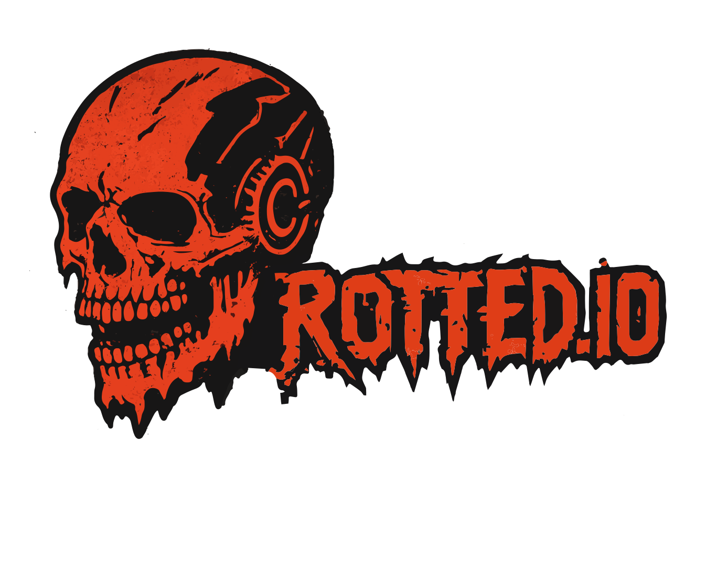

  

 
 

## Philosophy

The internet is rotting under corporate control. Personal data, online interactions, and digital identities are commodified, controlled, and monetized. This project is my own personal push back against that erosion.

**rotted.io** is a conscious effort to reclaim ownership my own digital life through self-hosting, creating a space where privacy, customization, and independence are prioritized.

This is as much a statement about freedom and autonomy in the digital age as it is a hobby project to further my own education.

I don't expect anybody to be all that fussed about the project specifically, however i'm publishing this just in case somebody sees something they like, and they wanna work it into their own Projects.

 
 

---

 

## License

**CC BY-NC-SA 4.0** - Creative Commons Attribution-NonCommercial-ShareAlike 4.0

### NO COMMERCIAL USE. EVER.

You are free to:
- Use, modify, and redistribute
- Publish under your own name (with attribution)
- Build upon and remix

You may NOT:
- Use for commercial purposes
- Monetize in any way
- Incorporate into commercial products
- Sell or profit from this code

The rot stops here.

Full license: [LICENSE](./LICENSE)
